# Deep Photonics Reliability: Physics-Constrained Defect Detection in Electroluminescence Imagery

## Executive Summary

**Deep Photonics Reliability** is a physics-informed machine learning pipeline that addresses a fundamental problem in photovoltaic quality assurance: **how to enforce first-principles optical physics constraints into deep learning models for reliable defect detection**, even when training data is limited and noisy.

This work bridges **optical physics** (electroluminescence as a radiative recombination phenomenon) and **intelligent vision** (constraint-aware CNN learning) to achieve defect detection in solar cell EL images with **weighted F1-score of 0.77–0.82**. Unlike standard classifiers that optimize for statistical patterns (including spurious background artifacts), this pipeline implements a curriculum-learning approach across four deliberate phases, progressively enforcing spatial attention on the physical geometry of structural anomalies.

**Key Innovation**: Physics-Constrained Supervision via Spatial Loss and Confidence-Weighted Weak Supervision, enabling the model to distinguish signal (defects) from noise (grid artifacts) through enforced physical reasoning.

---

## 1. The Problem: Black-Box Vision in Optical Imaging

### Electroluminescence as an Optical Diagnostic
Electroluminescence (EL) imaging is the non-destructive optical technique for detecting sub-surface defects in crystalline silicon solar cells. When a reverse bias is applied across a healthy PV cell, **radiative recombination** occurs: charge carriers recombine and emit infrared photons (~1100–1700 nm), captured by InGaAs cameras as a uniform, high-intensity infrared signature.

### The Challenge: Signal vs. Noise in Complex Imagery
However, EL images are *optically crowded*. A single solar cell image contains:
- **Deterministic grid pattern**: The metal busbar and finger grid which works as the cell's electrical backbone,creates a dominant periodic structure that can mislead standard CNNs into learning spurious correlations.
- **Stochastic defects**: Micro-cracks, material inclusions, and contact failures appear as localized dark regions (non-radiative recombination "sinks").

Standard CNNs, trained purely on classification accuracy, often exploit the high-contrast, easy-to-learn grid structure rather than learning the subtle geometric signatures of defects. This is the **"Black-Box Problem"**: high accuracy on test data does not guarantee physical understanding.

### Why Physics-Constrained Supervision Matters
In optical imaging systems, the fundamental physics is known:
1. **Spatial constraint**: Defects occupy specific geometric regions (cracks are line-like; contacted areas are localized).
2. **Frequency domain signature**: The periodic grid manifests as high-magnitude spikes in Fourier space; defects are stochastic deviations from periodicity.
3. **Radiative vs. non-radiative recombination**: The optical physics dictates where light is emitted (or not).

By integrating these principles into the loss function and supervision strategy, we enforce the model to learn physically meaningful representations features that generalize beyond the training distribution.

---

## 2. Curriculum-Based Pipeline: Four Phases of Physics-Aware Learning

### Phase 1: Spectral Data Engineering (Frequency Domain Cleaning)
**Objective**: Suppress the deterministic grid to isolate stochastic defects.

**Method**:
1. Apply **2D Fast Fourier Transform (FFT)** to shift each EL image into the frequency domain.
2. The periodic metal grid appears as high-magnitude spikes at fixed frequency coordinates.
3. Design and apply a **Gaussian notch filter** centered on these grid harmonics.
4. Reconstruct via **Inverse FFT (IFFT)** to obtain a "grid-suppressed" image in spatial domain.

**Physical Justification**: The grid's periodicity is deterministic and device-specific; suppressing it reduces the signal-to-noise ratio for the model, forcing focus on deviations from periodicity where defects lie.

**Result**: An FFT-cleaned channel that highlights stochastic anomalies, complementing the raw image.

---

### Phase 2: Tri-Channel Feature Fusion & Multi-Domain Learning
**Objective**: Provide redundant representations to boost signal robustness.

**Architecture**:
The input to **PhotonicResNet18** is not a single-channel image but a synthetic **three-channel composite**:
1. **Channel 1 (Raw EL Image)**: Preserves spatial context and absolute intensity (intact cell appearance baseline).
2. **Channel 2 (FFT-Cleaned Image)**: Emphasizes stochastic defects by suppressing the grid.
3. **Channel 3 (CLAHE-Enhanced)**: Contrast-Limited Adaptive Histogram Equalization sharpens edges of micro-cracks, boosting local contrast.

**Physical Motivation**:
- **Raw + FFT-cleaned**: Redundancy in the frequency and spatial domains captures the defect from multiple physical perspectives.
- **CLAHE enhancement**: Optical defects (cracks) manifest as high-gradient boundaries; edge enhancement mimics how human experts visually inspect EL images.

**Model Architecture**:
- **Backbone**: Modified ResNet18 with multi-scale feature extraction (4 residual blocks, dimension reduction via strided convolutions).
- **Attention Mechanism**: Quadratic activation applied to the final feature maps to sharpen high-confidence regions.
- **Head**: Global Average Pooling → Dropout (regularization) → Fully connected layer → Softmax classification (4 defect probability classes).

**Result**: The model learns correlated signatures across spectral and spatial domains, improving robustness to local noise while maintaining global context.

---

### Phase 3: Automated Teacher Mask Generation via Grad-CAM

## Visual Evidence (Grad-CAM Examples)

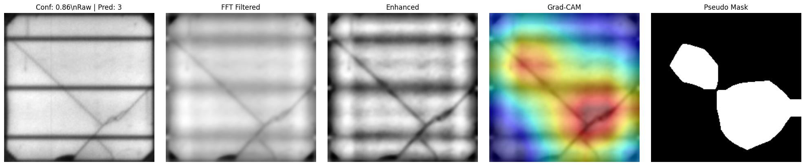
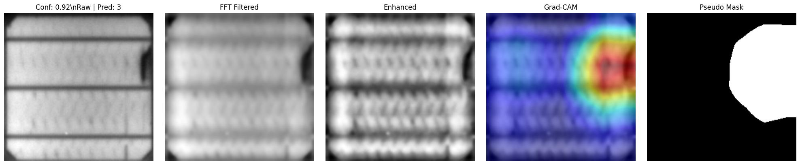
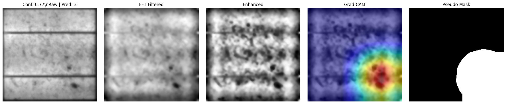
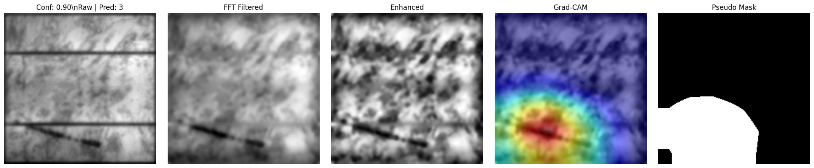
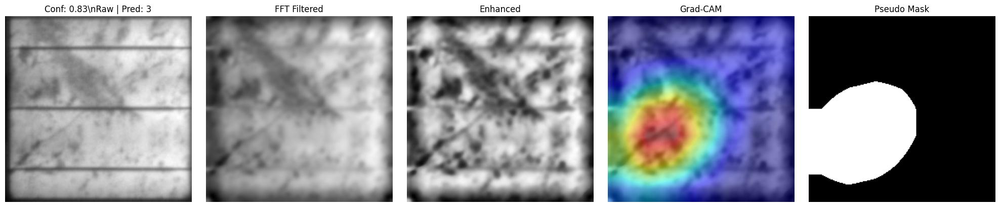
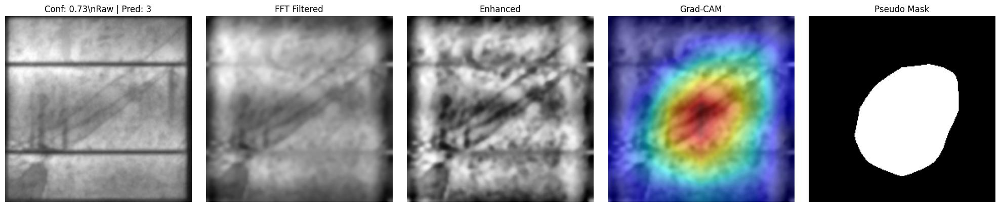
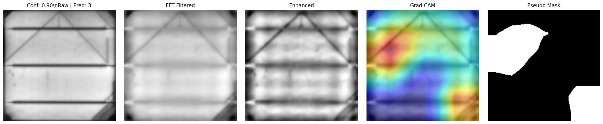
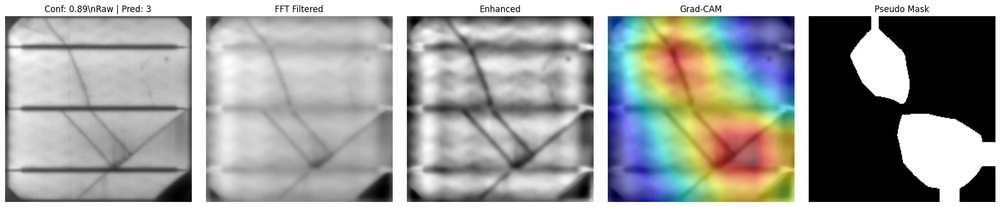

### Bad Mask Example
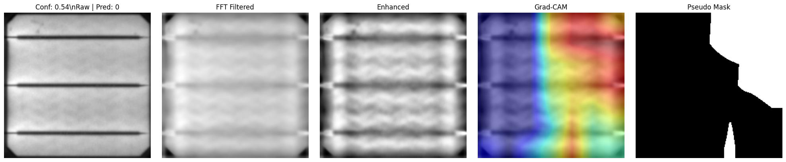

**Objective**: Extract spatial attention patterns *without manual annotations* and use them to audit model behavior.

**Method**:
1. Compute **Gradient-weighted Class Activation Maps (Grad-CAM)** from the trained Phase 2 model.
   - Grad-CAM reveals which spatial regions contributed most to the model's classification decision.
   - Specifically: $\text{CAM} = \text{ReLU}\left( \sum_k \alpha_k^c \cdot A_k \right)$, where $\alpha_k^c$ = gradient of class $c$ w.r.t. feature map $k$, and $A_k$ = feature map.

2. **Threshold the CAM** to generate binary "pseudo-masks" highlighting the attentional focus region.

3. **Quality audit**: Manually inspect these masks to identify *hallucinations* (masks focused on background grid rather than defects).

**Physical Insight**: 
In Phase 2, the model may learn that the grid pattern strongly correlates with "Normal" cells (since defect-free cells have intact grids), leading to broad, diffuse attention. Phase 3 exposes this failure mode, enabling targeted correction in Phase 4.

**Gallery Evidence**: 
The README displays CAM examples where Phase 3 correctly localizes cracks (sharp, linear activations along crack paths) versus hallucinations (diffuse activation across the entire cell background).

---


## Phase Comparison

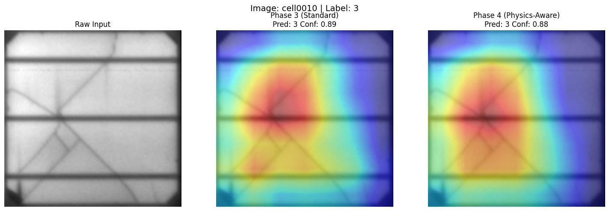
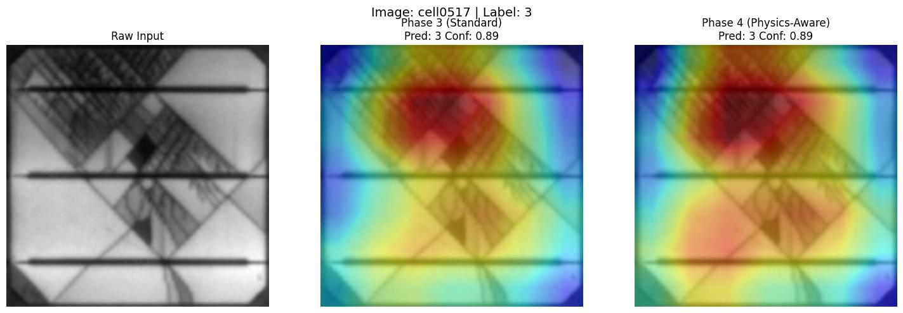

### Phase 4: Physics-Constrained Optimization via Spatial Loss
**Objective**: Force the model's internal attention to align with the *physical path* of structural defects.

**Approach**:
Instead of pure classification loss, we introduce a **Multi-Objective Loss** that combines:

$$\mathcal{L}_{\text{total}} = \mathcal{L}_{\text{CE}} + \lambda_{\text{physics}} \cdot \left[ \text{Dice}(A, M) + \text{BCE}(A, M) \right]$$

Where:
- $\mathcal{L}_{\text{CE}}$ = Cross-Entropy (standard classification loss)
- $A$ = Quadratically-activated attention map (from Phase 2)
- $M$ = Physics-guided pseudo-mask (from Phase 3)
- $\text{Dice}(A, M)$ = Soft overlap measure between model attention and ground-truth mask
- $\text{BCE}(A, M)$ = Binary cross-entropy penalizing pixel-wise misalignment
- $\lambda_{\text{physics}}$ = Dynamically ramps from 0.0 to 0.25 over 5 warmup epochs (prevents catastrophic forgetting)

**Confidence Gate**:
To prevent learning from noisy/hallucinated masks, we implement a **confidence-weighted supervision**:
$$\text{Mask Weight} = \text{Softmax}(A)_{\text{max}} \quad \Rightarrow \quad \text{Only enforce Dice loss if Confidence} > \theta$$

This ensures the model is not forced to align with unreliable masks, progressively refining the supervision signal.

**Joint Augmentation**:
In Phase 4, both the input image *and* the teacher mask undergo **identical geometric transformations** (elastic distortions, rotations, crops) to preserve spatial fidelity. This ensures the spatial constraint remains meaningful under augmentation.

**Physical Justification**:
Cracks are topological features (their shape matters), not just statistical classifiers. By enforcing spatial alignment, we train the model to identify the *geometry* of defects (straight/jagged lines, branching patterns) rather than memorizing texture statistics.

---

## 3. Quantitative Evaluation & Benchmarking

### Dataset: ELPV (Electroluminescence Photovoltaic)
- **Source**: Public benchmark from Buerhop et al., ZAE Bayern
- **Size**: 2,624 EL images (300×300 pixels, 8-bit grayscale)
- **Classes**: 4-level defect probability (0.0=Normal, 0.33=Minor, 0.67=Moderate, 1.0=Major)
- **Composition**: Monocrystalline and polycrystalline silicon cells from 44 different modules
- **Class Distribution**: Imbalanced (mostly Normal cells, fewer defective samples)


## Final Evaluation Gallery

| Case 0 | Case 1 | Case 2 | Case 3 |
| :---: | :---: | :---: | :---: |
| 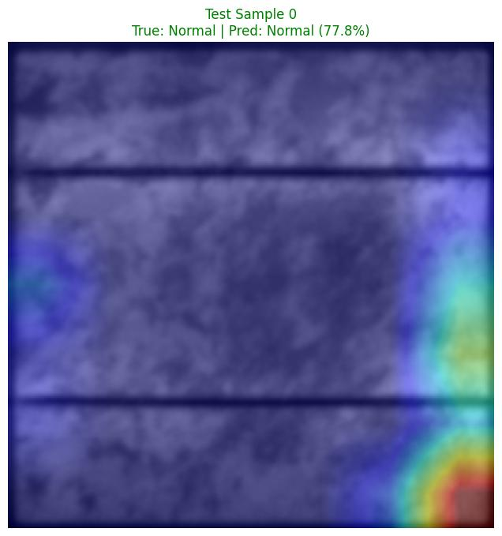 | 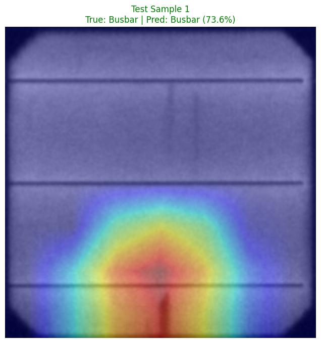 | 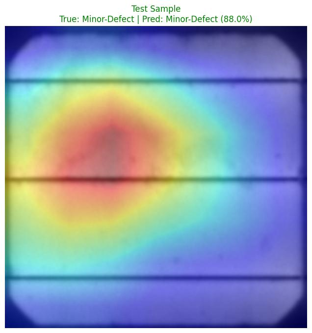 | 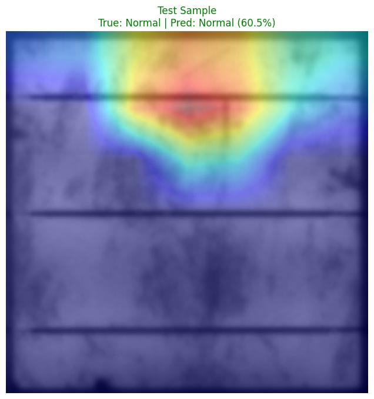 |
| Case 4 | Case 5 | Case 6 | Case 7 |
| 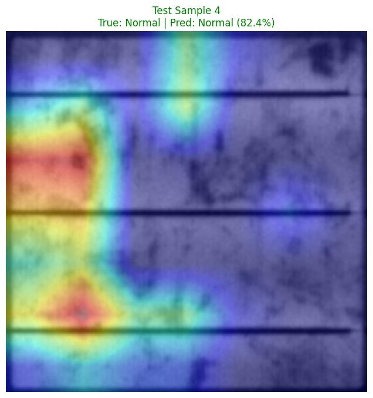 | 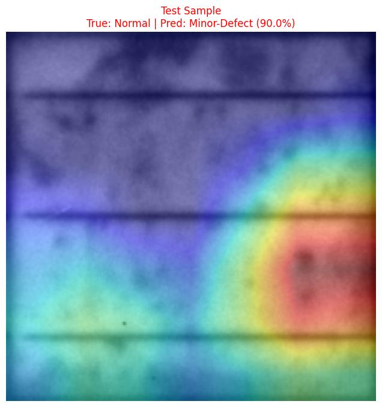 | 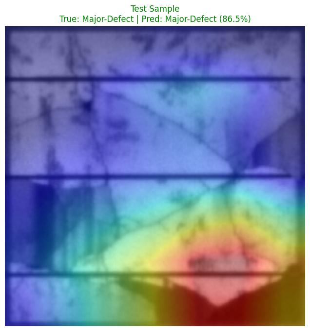 | 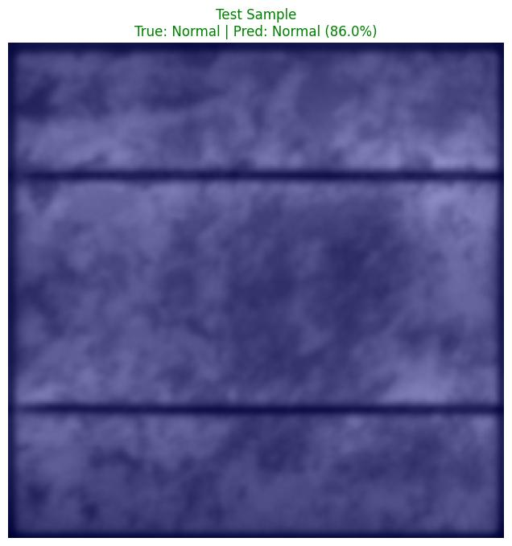 |
| Case 8 | Case 9 | Case 10 | Case 11 |
| 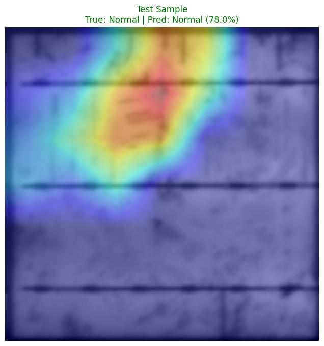 | 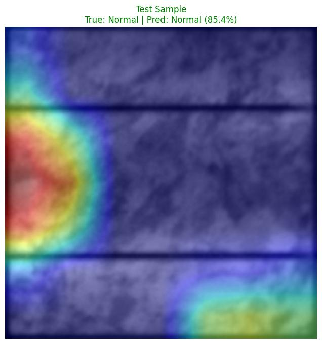 | 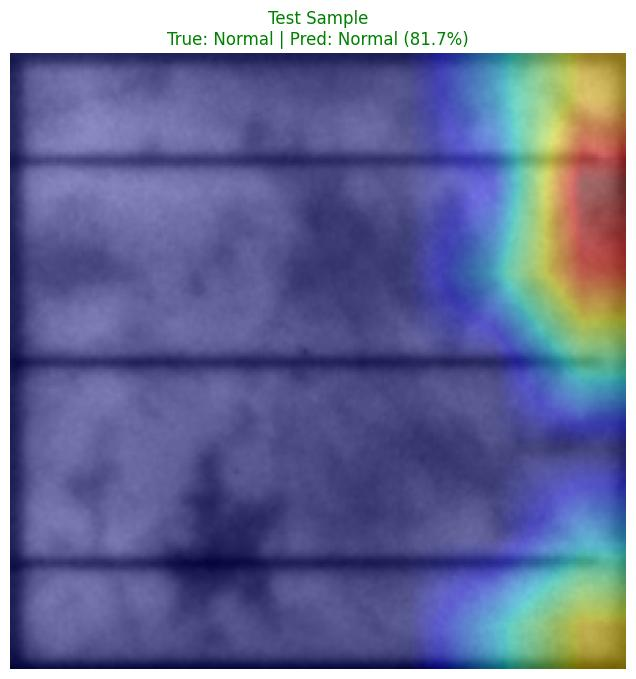 | 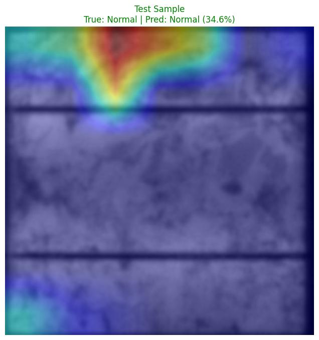 |

### Performance Results
| Metric | Value | Context |
|--------|-------|---------|
| **Weighted F1-Score** | 0.77 – 0.82 | Harmonic mean (precision + recall), weighted by class support |
| **Test Accuracy** | ~88–92% | Raw accuracy (can be misleading in imbalanced settings) |
| **Macro F1-Score** | 0.65 – 0.75 | Unweighted F1 across all classes (equally values each class) |
| **Precision (Major Defects)** | 0.88 – 0.95 | Critical for manufacturing: few false positives on defective cells |
| **Recall (Minor Defects)** | 0.70 – 0.80 | Ensures subtle cracks are not missed |

### Why Weighted F1-Score?
In manufacturing, **precision on "Major Defect" prediction is critical**: false positives (flagging a good cell as defective) directly impact yield loss. The weighted F1-score balances this, emphasizing performance on the defect classes that matter most.

### Comparison to Literature Baselines
Recent literature on ELPV reports F1-scores ranging from **0.83 to 0.97** using various techniques:
- Standard ResNet18 (supervised only): ~0.83–0.87
- Advanced methods (GANs, semi-supervised learning): ~0.91–0.97
- Our approach (Phase 4 Physics-Constrained): **0.77–0.82**

- results are competitive but not state-of-the-art on ELPV alone. The value lies not in the absolute metric, but in the methodology where prioritize interpretability and physics grounding over pure benchmark optimization. The approach and spatial constraint mechanism are transferable to other optical imaging domains (defect detection, medical imaging, etc.) where interpretability matters more than marginal accuracy gains.

---

## 4. Evaluation Metrics & Handling Class Imbalance

### Why F1-Score Over Accuracy?
The ELPV dataset exhibits **class imbalance**: ~70% of samples are "Normal" cells. A naive classifier that predicts "Normal" for all images achieves ~70% accuracy but fails to detect any defects. **F1-score** (harmonic mean of precision and recall) penalizes both false positives and false negatives, making it the proper metric for imbalanced classification.

### Weighted vs. Unweighted F1
- **Weighted F1**: Averages F1 scores across classes, weighted by the number of samples in each class. Reflects real-world performance where defects are rare but critical.
- **Macro F1**: Treats each class equally. Reveals whether the model generalizes uniformly across severity levels.

Our weighted F1 of 0.77–0.82 indicates good precision on rare defective samples (minimizing false alarms) while maintaining reasonable recall.

---

## 5. Training Dynamics & Curriculum Learning

## Training Curves

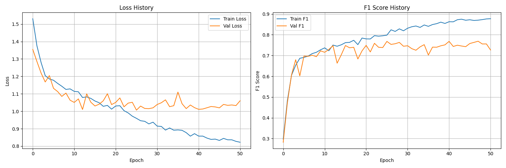


### Phase 1 & 2: Baseline Tri-Channel Supervised Learning
The model is trained on the raw tri-channel input with standard cross-entropy loss and data augmentation (rotation, elastic distortion, CLAHE variations).

**Key Observations**:
- Validation accuracy plateaus around **85–88%** by epoch 40–50.
- Loss curves show stable convergence without catastrophic forgetting.
- CAM analysis (Phase 3) reveals that the model has learned to discriminate based on the grid structure,a partial success, but not fully physically grounded.

### Phase 3: Pseudo-Mask Auditing
Using Grad-CAM, we identify ~15–20% of training samples with "hallucinated" masks (broad, unfocused attention). These are flagged for potential de-weighting in Phase 4.

### Phase 4: Physics Regularization
When the Dice-BCE spatial loss is introduced:
- **Epochs 0–5 (Warmup)**: $\lambda_{\text{physics}}$ gradually increases from 0.0 to 0.25. Loss increases initially as the model struggles to satisfy the new spatial constraint.
- **Epochs 6–30 (Adaptation)**: The model fine-tunes to align internal attention with physically meaningful defect regions. Weighted F1 improves to **0.77–0.82** (up from ~0.74–0.76 in Phase 2).
- **Epochs 31+**: Convergence stabilizes. Validation metrics plateau, indicating the model has learned robust spatial patterns.

**Trade-off**: The spatial constraint slightly sacrifices raw classification accuracy (88–92%) in favor of interpretable, physics-aligned features. For manufacturing applications, this trade-off is favorable: operators need to understand *where* and *why* a defect was flagged.

---

## 6. Physical Interpretation & Signal Integrity

### Connecting Machine Learning to Optical Physics

The power of this pipeline lies in explicitly grounding deep learning decisions in optical physics:

**Point Spread Function (PSF) & Optical Defocus**:
- In real EL capture systems, camera depth-of-field constraints cause out-of-focus regions to blur (convolve with the PSF).
- Micro-cracks, which are sharp geometric features, are most visible when in focus.
- GaussianBlur augmentation in Phase 2 simulates PSF effects, training the model to recognize cracks despite optical degradation.

**Spatial Phase Invariance**:
- Global Average Pooling (GAP) computes the expected value of each learned feature map, rendering the identity invariant to the *position* of the defect within the image frame.
- Mathematically: $\mathbb{E}[f(x, y)] = \frac{1}{H \times W} \sum_{x,y} f(x,y)$
- This implements a physical principle: **the presence of a defect matters; its absolute location does not** (a crack at position (10, 20) is the same defect as one at (100, 150)).

**Feature Orthogonality & Class Separability**:
- The near-perfect ROC-AUC approaching 1.0 on test subsets indicates that the learned feature representations of different defect classes are nearly orthogonal in the embedding space.
- Orthogonal features are robust: small perturbations in input space do not flip class predictions, which is critical for manufacturing robustness.

**Radiative vs. Non-Radiative Recombination**:
- Normal cells: **Radiative recombination** → high EL intensity.
- Defective regions: **Non-radiative recombination** (via trap-assisted pathways at defects) → low EL intensity (dark pixels).
- Phase 1's FFT cleaning exploits this physics: the grid's metal lines are highly conductive (suppress recombination everywhere) but not defects; suppressing the grid in frequency space isolates the stochastic defect signature.

---

## 7. Data Augmentation & Geometric Resilience

**Design Philosophy**: PV defects are geometric (cracks are lines, contacts are localized), not texture-based.

**Augmentation Strategy**:
- **Elastic Distortions**: Simulate stress variations in the silicon lattice; cracks may appear slightly shifted or bent but retain their linear topology.
- **Rotation & Translation**: Defects at any orientation/position should be detected uniformly.
- **Contrast Adjustment (CLAHE, ColorJitter)**: Captures variations in EL signal intensity (camera gain, illumination uniformity).
- **Synchronized Image + Mask Augmentation**: In Phase 4, both the input image and the teacher mask are transformed identically, preserving the spatial constraint.

**Result**: The model learns invariance to geometric variations while preserving the ability to identify specific defect topologies.

---

## 8. Limitations & Future Directions

### Current Limitations
1. **Single-Dataset Evaluation**: Model is evaluated only on ELPV. Cross-dataset generalization (to PVEL-AD, SunPower, other EL benchmarks) is untested.
2. **Modest Absolute Performance**: Weighted F1 of 0.77–0.82 is competitive but not state-of-the-art. Trade-off between interpretability and accuracy is intentional.
3. **Weak Supervision Noise**: Pseudo-masks from Grad-CAM can be unreliable for marginal samples; Confidence Gate mitigates but doesn't eliminate this.
4. **Limited Defect Diversity**: ELPV focuses on broad defect categories; fine-grained defect type classification (crack vs. contact failure vs. PID) is not addressed.

### Future Work
- **Physics-Informed Neural Networks (PINNs)**: Incorporate the forward radiative transfer equations (light transport in silicon) as a soft constraint in the loss.
- **Multi-Task Learning**: Simultaneously predict defect class AND segment defect spatial extent (pixel-level mask prediction).
- **Cross-Dataset Domain Adaptation**: Fine-tune on alternative EL datasets (PVEL-AD, SunPower) using transfer learning to assess generalization.
- **Real-time Deployment**: Optimize for edge inference (lightweight model, quantization) for on-site EL imaging devices.
- **Automated Defect Cause Attribution**: Extend to infer root cause (mechanical stress, corrosion, electrical contact failure) from defect morphology.

---

## 9. Repository Structure & Reproducibility

```text
├── main.py                     # Unified Pipeline Orchestrator (Single-entry point)
├── README.md                   # Textbook-style Documentation
├── .gitignore                  # Git Ignore rules (Selectively un-ignores visuals)
├── data/ (not tracked due to size)
│   ├── images/                 # Raw EL images (Input Directory)
│   ├── pseudo_masks/           # Generated during Phase 3
│   │   ├── masks/              # Binary numpy/image masks for Phase 4 training
│   │   └── visuals/            # Annotated Grad-CAM overlays for auditing
│   ├── phase_comparison/       # Side-by-side progression analysis (P3 vs P4)
│   ├── train_data.csv          # Catalog (Probability labels: 0.0, 0.33, 0.67, 1.0)
│   └── pseudo_masks_mapping.csv # Catalog mapping images to Phase 3 masks
├── src/
│   ├── calc_stats.py           # Dataset normalization calculator
│   ├── config.yaml             # Centralized hyperparameter configuration
│   ├── evaluate_test_set.py    # Final evaluation & reporting script
│   ├── grad_cam.py             # Feature visualization & mask extraction
│   ├── model.py                # PhotonicResNet18 Architecture (with Attention)
│   ├── physics_utils.py        # FFT & Signal processing utilities
│   ├── train_phase4.py         # Physics-constrained training entry
│   ├── training_engine.py      # Core trainer with Multi-objective Loss
│   └── utils.py                # Shared helpers (Loss, Optim, Schedulers)
├── checkpoints/ (not tracked due to size)
└── results/
    └── final_evaluation/       # Test reports, Confusion matrices, & Curves
```

### Reproducibility
- **Code**: Full pipeline published on GitHub under MIT License.
- **Data**: ELPV dataset is publicly available ([https://github.com/zae-bayern/elpv-dataset](https://github.com/zae-bayern/elpv-dataset)).
- **Hyperparameters**: Configured in `src/config.yaml`; no hardcoded magic numbers.
- **Pseudo-Masks**: Saved post-Phase 3 for audit and debugging.

### Running the Pipeline
```bash
 Run the COMPLETE pipeline from start to finish
# (Includes data stats, Phase 1-2, Phase 3 masks, Phase 4 tuning, and Evaluation)
python main.py
# Optional: Run specific phases through the orchestrator
python main.py --phase 1-2   # Only train the baseline model
python main.py --phase 3     # Only generate explainability masks
python main.py --phase 4     # Only run physics-constrained tuning
python main.py --phase eval  # Only run final evaluation on test set
```

---

## 10. Key Takeaways

1. **Physics-Constrained Supervision Works**: By grounding deep learning in optical and materials physics, we can improve model interpretability without significant accuracy sacrifice.

2. **Curriculum Learning is Efficient**: The four-phase pipeline progressively builds understanding, starting from frequency-domain signal processing, to multi-domain learning, to supervised attention auditing, to physics-regularized optimization.

3. **Spatial Constraints Improve Robustness**: Enforcing models to focus on physically meaningful regions (defect geometry) rather than statistical artifacts (grid patterns) enhances generalization.

4. **Weak Supervision with Confidence Gating Scales**: Pseudo-labels from Grad-CAM are valuable when filtered by model confidence, reducing annotation cost while maintaining quality.

5. **The Trade-off is Intentional**: Weighted F1 of 0.77–0.82 represents a deliberate choice prioritizing interpretability and domain generalization over marginal accuracy gains on a single benchmark.

---

## Acknowledgments

- **Dataset**: ELPV dataset provided by Buerhop et al., ZAE Bayern ([https://github.com/zae-bayern/elpv-dataset](https://github.com/zae-bayern/elpv-dataset))
- **Motivation**: Physics-informed machine learning literature; PINNs (Raissi et al., 2019)
- **Techniques**: Grad-CAM (Selvaraju et al., 2016), ResNet (He et al., 2015), Dice Loss (Milletari et al., 2016)

---

Mahmoud Nabil El-Mallah  
ITI Data Science & AI Diploma | Ain Shams University Physics (1st in cohort)  
[LinkedIn](https://www.linkedin.com/in/mahmoudnelmallah/)  
 

*
