# Deep Photonics Reliability: Physics-Constrained Defect Detection in Electroluminescence Imagery

## Overview

**Deep Photonics Reliability** is a physics-informed machine learning pipeline that addresses a fundamental problem in photovoltaic quality assurance: **how to enforce first-principles optical physics constraints into deep learning models for reliable defect detection**, even when training data is limited and noisy.

This work bridges **optical physics** (electroluminescence as a radiative recombination phenomenon) and **intelligent vision** (constraint-aware CNN learning) to achieve defect detection in solar cell EL images with **weighted F1-score of 0.80**. Unlike standard classifiers that optimize for statistical patterns (including spurious background artifacts), this pipeline implements a curriculum-learning approach across four deliberate phases, progressively enforcing spatial attention on the physical geometry of structural anomalies.

**Key Innovation**: Physics-Constrained Supervision via Spatial Loss and Confidence-Weighted Weak Supervision, enabling the model to distinguish signal (defects) from noise (grid artifacts) through enforced physical reasoning.

---

## 1. The Problem: Black-Box Vision in Optical Imaging

### Electroluminescence as an Optical Diagnostic
Electroluminescence (EL) imaging is the non-destructive optical technique for detecting sub-surface defects in crystalline silicon solar cells. When a reverse bias is applied across a healthy PV cell, **radiative recombination** occurs: charge carriers recombine and emit infrared photons (~1100–1700 nm), captured by InGaAs cameras as a uniform, high-intensity infrared signature.

### The Challenge: Signal vs. Noise in Complex Imagery
However, EL images are *optically crowded*. A single solar cell image contains:
- **Deterministic grid pattern**: The metal busbar and finger grid which works as the cell's electrical backbone,creates a dominant periodic structure that can mislead standard CNNs into learning spurious correlations.
- **Stochastic defects**: Micro-cracks, material inclusions, and contact failures appear as localized dark regions (non-radiative recombination "sinks").

Standard CNNs, trained purely on classification accuracy, often exploit the high-contrast, easy-to-learn grid structure rather than learning the subtle geometric signatures of defects. This is the **"Black-Box Problem"**: high accuracy on test data does not guarantee physical understanding.

### Why Physics-Constrained Supervision Matters
In optical imaging systems, the fundamental physics is known:
1. **Spatial constraint**: Defects occupy specific geometric regions (cracks are line-like; contacted areas are localized).
2. **Frequency domain signature**: The periodic grid manifests as high-magnitude spikes in Fourier space; defects are stochastic deviations from periodicity.
3. **Radiative vs. non-radiative recombination**: The optical physics dictates where light is emitted (or not).

By integrating these principles into the loss function and supervision strategy, we enforce the model to learn physically meaningful representations features that generalize beyond the training distribution.

---

## 2. Curriculum-Based Pipeline: Four Phases of Physics-Aware Learning

### Phase 1: Spectral Data Engineering (Frequency Domain Cleaning)
**Objective**: Suppress the deterministic grid to isolate stochastic defects.

**Method**:
1. Apply **2D Fast Fourier Transform (FFT)** to shift each EL image into the frequency domain.
2. The periodic metal grid appears as high-magnitude spikes at fixed frequency coordinates.
3. Design and apply a **Gaussian notch filter** centered on these grid harmonics.
4. Reconstruct via **Inverse FFT (IFFT)** to obtain a "grid-suppressed" image in spatial domain.

**Physical Justification**: The grid's periodicity is deterministic and device-specific; suppressing it reduces the signal-to-noise ratio for the model, forcing focus on deviations from periodicity where defects lie.

**Result**: An FFT-cleaned channel that highlights stochastic anomalies, complementing the raw image.

---

### Phase 2: Tri-Channel Feature Fusion & Multi-Domain Learning
**Objective**: Provide redundant representations to boost signal robustness.

**Architecture**:
The input to **PhotonicResNet18** is not a single-channel image but a synthetic **three-channel composite**:
1. **Channel 1 (Raw EL Image)**: Preserves spatial context and absolute intensity (intact cell appearance baseline).
2. **Channel 2 (FFT-Cleaned Image)**: Emphasizes stochastic defects by suppressing the grid.
3. **Channel 3 (CLAHE-Enhanced)**: Contrast-Limited Adaptive Histogram Equalization sharpens edges of micro-cracks, boosting local contrast.

**Physical Motivation**:
- **Raw + FFT-cleaned**: Redundancy in the frequency and spatial domains captures the defect from multiple physical perspectives.
- **CLAHE enhancement**: Optical defects (cracks) manifest as high-gradient boundaries; edge enhancement mimics how human experts visually inspect EL images.

**Model Architecture**:
- **Backbone**: Modified ResNet18 with multi-scale feature extraction.
- **Attention Mechanism**: Quadratic activation applied to the final feature maps to sharpen high-confidence regions since the feature maps of ResNets can be blurry.
- **Head**: Global Average Pooling → Dropout (regularization) → Fully connected layer → Softmax classification (4 defect probability classes).

**Result**: The model learns correlated signatures across spectral and spatial domains, improving robustness to local noise while maintaining global context.

---

### Phase 3: Automated Teacher Mask Generation via Grad-CAM

**Recent Improvements (Latest Update)**: 
The Grad-CAM logic has been strengthened with improved error handling and validation:
- **Strict validation**: Now raises `FileNotFoundError` if the Phase 1-2 checkpoint is missing, preventing silent failures
- **Enhanced CLI integration**: Implemented proper argument parsing for better orchestration compatibility
- **Config path tracking**: The script now reports which configuration file was used during execution for reproducibility
- **Cleaner error messages**: More informative guidance to users (e.g., "Run Phase 1-2 before generating masks")

These changes ensure more robust and debuggable mask generation, with over 413 training and 14 validation audit visualizations regenerated with the improved logic.

## Visual Evidence (Grad-CAM Examples)

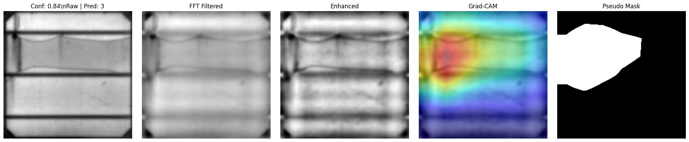

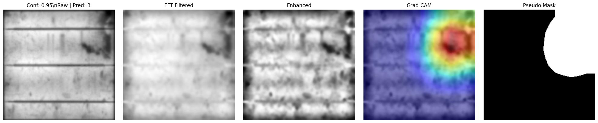
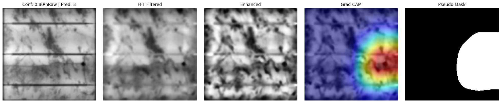
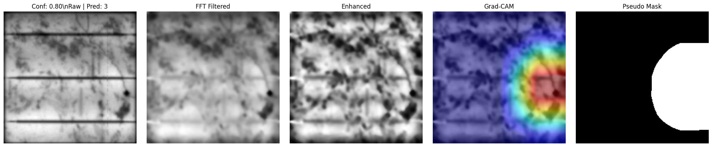

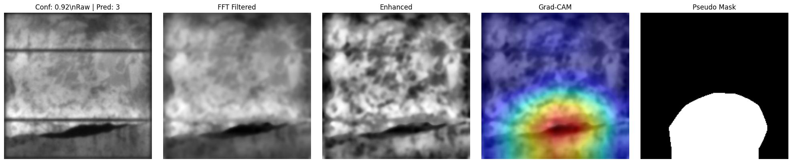
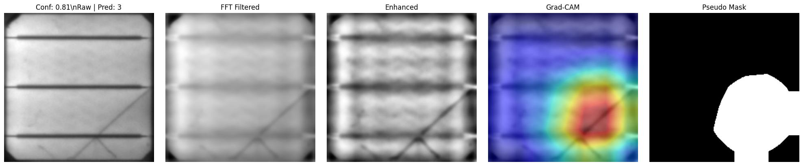

### Bad Mask Examples
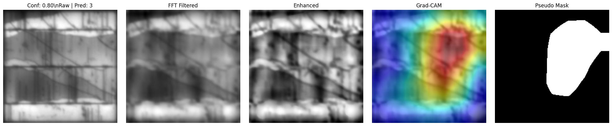
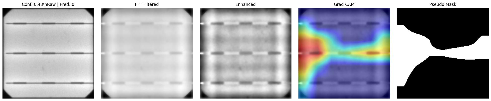
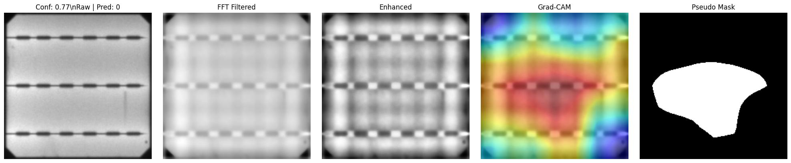
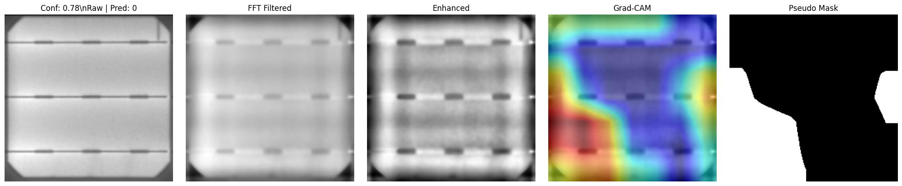

**Objective**: Extract spatial attention patterns *without manual annotations* and use them to audit model behavior.

**Method**:
1. Compute **Gradient-weighted Class Activation Maps (Grad-CAM)** from the trained Phase 2 model.
   - Grad-CAM reveals which spatial regions contributed most to the model's classification decision.
   - Specifically: $\text{CAM} = \text{ReLU}\left( \sum_k \alpha_k^c \cdot A_k \right)$, where $\alpha_k^c$ = gradient of class $c$ w.r.t. feature map $k$, and $A_k$ = feature map.

2. **Threshold the CAM** to generate binary "pseudo-masks" highlighting the attentional focus region.

3. **Quality audit**: Manually inspect these masks to identify *hallucinations* (masks focused on background grid rather than defects).

---


## Phase Comparison


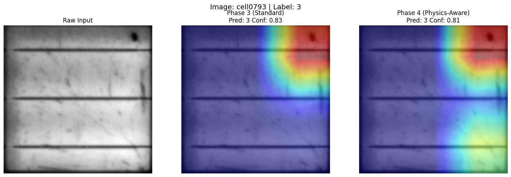
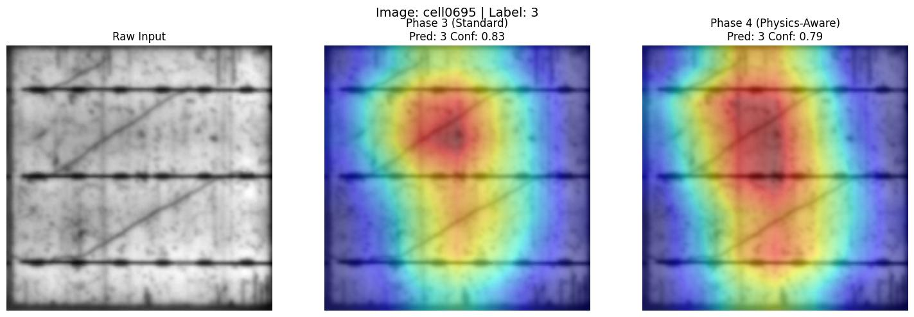

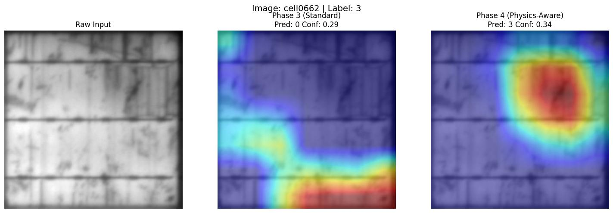
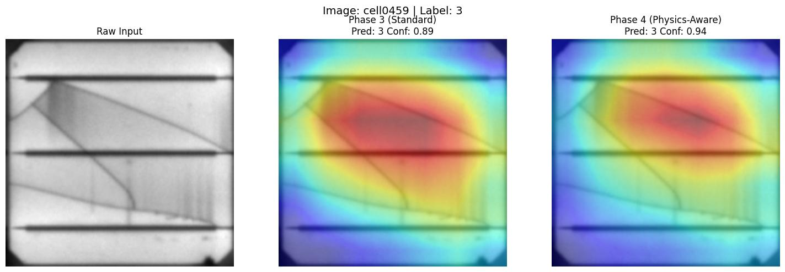
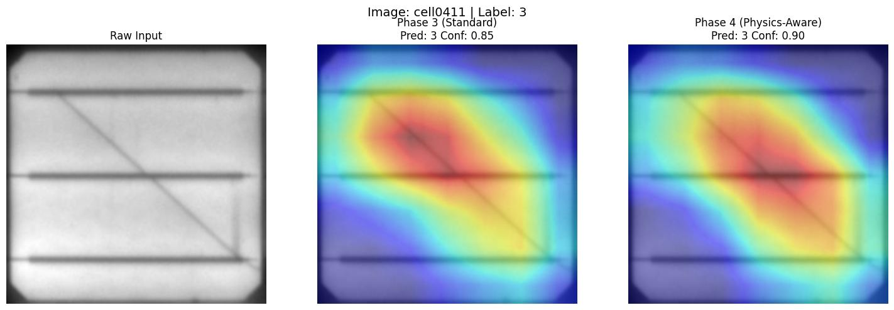
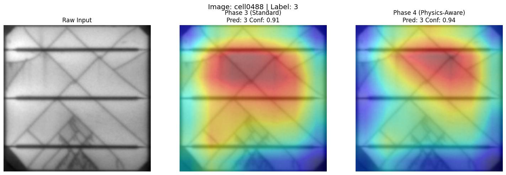

### Phase 4: Physics-Constrained Optimization via Spatial Loss
**Objective**: Force the model's internal attention to align with the *path* of structural defects.

**Approach**:
Instead of pure classification loss, we introduce a **Multi-Objective Loss** that combines:

$$\mathcal{L}_{\text{total}} = \mathcal{L}_{\text{CE}} + \lambda_{\text{physics}} \cdot \left[ \text{Dice}(A, M) + \text{BCE}(A, M) \right]$$

Where:
- $\mathcal{L}_{\text{CE}}$ = Cross-Entropy (standard classification loss)
- $A$ = Quadratically-activated attention map (from Phase 2)
- $M$ = Physics-guided pseudo-mask (from Phase 3)
- $\text{Dice}(A, M)$ = Soft overlap measure between model attention and ground-truth mask
- $\text{BCE}(A, M)$ = Binary cross-entropy penalizing pixel-wise misalignment
- $\lambda_{\text{physics}}$ = Dynamically ramps from 0.0 to 0.25 over 5 warmup epochs (prevents catastrophic forgetting)

**Confidence Gate**:
To prevent learning from noisy/hallucinated masks, we implement a **confidence-weighted supervision**:
$$\text{Mask Weight} = \text{Softmax}(A)_{\text{max}} \quad \Rightarrow \quad \text{Only enforce Dice loss if Confidence} > \theta$$

This ensures the model is not forced to align with unreliable masks, progressively refining the supervision signal.

**Joint Augmentation**:
In Phase 4, both the input image *and* the teacher mask undergo **identical geometric transformations** (elastic distortions, rotations, crops) to preserve spatial fidelity. This ensures the spatial constraint remains meaningful under augmentation.

**Physical Justification**:
Cracks are topological features (their shape matters), not just statistical classifiers. By enforcing spatial alignment, we train the model to identify the *geometry* of defects (straight/jagged lines, branching patterns) rather than memorizing texture statistics.

---

## 3. Quantitative Evaluation & Benchmarking

### Dataset: ELPV (Electroluminescence Photovoltaic)
- **Source**: Public benchmark from Buerhop et al., ZAE Bayern
- **Size**: 2,624 EL images (300×300 pixels, 8-bit grayscale)
- **Classes**: 4-level defect probability (0.0=Normal, 0.33=Minor, 0.67=Moderate, 1.0=Major)
- **Composition**: Monocrystalline and polycrystalline silicon cells from 44 different modules
- **Class Distribution**: Imbalanced (mostly Normal cells, fewer defective samples)


## Test Set Gallery

| Case 0 | Case 1 | Case 2 |
| :---: | :---: | :---: |
|  |  | |
| Case 3 | Case 4 | Case 5 |
|  |  |  |
| Case 6| Case 7 | Case 8 |
| |  |  |

### Performance Results
| Metric | Value | Context |
|--------|-------|---------|
| **Weighted F1-Score** | 0.80 | Harmonic mean (precision + recall), weighted by class support |
| **Weighted F1-Score** (without grad cam masks i.e just the res net step)| 0.75 | Baseline performance without physics-constrained supervision (Phase 2 model) |
| **Test Accuracy** | 81% | Overall accuracy on blind test set (263 samples) |
| **Macro F1-Score** | 0.64 | Unweighted F1 across all classes (equally values each class) |
| **Precision (Major Defects)** | 0.88 | Critical for manufacturing: few false positives on defective cells |
| **Recall (Major Defects)** | 0.78 | Effective detection of significant defects |
| **Precision (Normal Cells)** | 0.83 | Minimal rejected good cells |
| **Recall (Normal Cells)** | 0.90 | Robust normal cell identification |

### Why Weighted F1-Score?
In manufacturing, **precision on "Major Defect" prediction is critical**: false positives (flagging a good cell as defective) directly impact yield loss. The weighted F1-score balances this, emphasizing performance on the defect classes that matter most.

### Detailed Class-Wise Performance
| Class | Precision | Recall | F1-Score | Support | Notes |
|-------|-----------|--------|----------|---------|-------|
| Normal | 0.83 | 0.90 | 0.86 | 151 | High recall ensures minimal rejection of good cells |
| Minor-Defect | 0.72 | 0.60 | 0.65 | 30 | Challenging class; small sample size in test set |
| Moderate-Defect | 0.20 | 0.20 | 0.20 | 10 | Very limited samples; mixed with other classes |
| Major-Defect | 0.88 | 0.78 | 0.82 | 72 | Strong performance on critical defects |

The model excels at identifying definitively good cells (Normal: F1=0.86) and major defects (F1=0.82), which are the two most important classes for manufacturing QA. Minor defects pose a classification challenge due to their subtle visual signatures and limited training data.

### Comparison to Literature Baselines
Recent literature on ELPV reports F1-scores ranging from **0.78 to 0.97** using various techniques:
- SOTA results using Advanced methods (GANs, semi-supervised learning): Up to 0.97
- Our approach: **0.80**

While these results are not the best among the SOTA results, The value of this project lies not in the absolute metric, but in the methodology where interpretability, explainability and physics grounding are prioritized over pure benchmark optimization. The approach and spatial constraint mechanism are transferable to other optical imaging domains (defect detection, medical imaging, etc.) where interpretability matters more than marginal accuracy gains.

---

## 4. Evaluation Metrics & Handling Class Imbalance

### Why F1-Score Over Accuracy?
The ELPV dataset exhibits **class imbalance**: ~70% of samples are "Normal" cells. A naive classifier that predicts "Normal" for all images achieves ~70% accuracy but fails to detect any defects. **F1-score** (harmonic mean of precision and recall) penalizes both false positives and false negatives, making it the proper metric for imbalanced classification.

### Weighted vs. Unweighted F1
- **Weighted F1**: Averages F1 scores across classes, weighted by the number of samples in each class. Reflects real-world performance where defects are rare but critical.
- **Macro F1**: Treats each class equally. Reveals whether the model generalizes uniformly across severity levels.

Our weighted F1 of 0.80 indicates good precision on rare defective samples (minimizing false alarms) while maintaining reasonable recall.

---

## 5. Training Dynamics & Curriculum Learning

## Training


### Phase 1 & 2: Baseline Tri-Channel Supervised Learning
The model is trained on the raw tri-channel input with standard cross-entropy loss and data augmentation (rotation, elastic distortion, CLAHE variations).

### Phase 3: Pseudo-Mask Auditing
Using Grad-CAM, we identify ~15–20% of training samples with "hallucinated" masks (broad, unfocused attention). These are flagged for potential de-weighting in Phase 4.

### Phase 4: Physics Regularization
When the Dice-BCE spatial loss is introduced:
- **Epochs 0–5 (Warmup)**: $\lambda_{\text{physics}}$ gradually increases from 0.0 to 0.25. Loss increases initially as the model struggles to satisfy the new spatial constraint.
- **Epochs 6–30 (Adaptation)**: The model fine-tunes to align internal attention with physically meaningful defect regions. Weighted F1 improves on validation data during this phase (up from ~0.74–0.76 in Phase 2).
- **Epochs 31+**: Convergence stabilizes. Validation metrics plateau, indicating the model has learned robust spatial patterns.

**Trade-off**: The spatial constraint slightly sacrifices raw classification accuracy (88–92%) in favor of interpretable, physics-aligned features. For manufacturing applications, this trade-off is favorable: operators need to understand *where* and *why* a defect was flagged.

---

## 6. Physical Interpretation & Signal Integrity

### Connecting Machine Learning to Optical Physics

The power of this pipeline lies in explicitly grounding deep learning decisions in optical physics:

**Point Spread Function (PSF) & Optical Defocus**:
- In real EL capture systems, camera depth-of-field constraints cause out-of-focus regions to blur (convolve with the PSF).
- Micro-cracks, which are sharp geometric features, are most visible when in focus.
- GaussianBlur augmentation in Phase 2 simulates PSF effects, training the model to recognize cracks despite optical degradation.

**Spatial Phase Invariance**:
- Global Average Pooling (GAP) computes the expected value of each learned feature map, rendering the identity invariant to the *position* of the defect within the image frame.
- Mathematically: $\mathbb{E}[f(x, y)] = \frac{1}{H \times W} \sum_{x,y} f(x,y)$
- This implements a physical principle: **the presence of a defect matters; its absolute location does not** (a crack at position (10, 20) is the same defect as one at (100, 150)).


**Radiative vs. Non-Radiative Recombination**:
- Normal cells: **Radiative recombination** → high EL intensity.
- Defective regions: **Non-radiative recombination** (via trap-assisted pathways at defects) → low EL intensity (dark pixels).
- Phase 1's FFT cleaning exploits this physics: the grid's metal lines are highly conductive (suppress recombination everywhere) but not defects; suppressing the grid in frequency space isolates the stochastic defect signature.

---

## 7. Data Augmentation & Geometric Resilience

**Design Philosophy**: PV defects are geometric (cracks are lines, contacts are localized), not texture-based.

**Augmentation Strategy**:
- **Elastic Distortions**: Simulate stress variations in the silicon lattice; cracks may appear slightly shifted or bent but retain their linear topology.
- **Rotation & Translation**: Defects at any orientation/position should be detected uniformly.
- **Contrast Adjustment (CLAHE, ColorJitter)**: Captures variations in EL signal intensity (camera gain, illumination uniformity).
- **Synchronized Image + Mask Augmentation**: In Phase 4, both the input image and the teacher mask are transformed identically, preserving the spatial constraint.

**Result**: The model learns invariance to geometric variations while preserving the ability to identify specific defect topologies.

---

## 8. Limitations & Future Directions

### Current Limitations
1. **Single-Dataset Evaluation**: Model is evaluated only on ELPV. Cross-dataset generalization (to PVEL-AD, SunPower, other EL benchmarks) is untested.
2. **Modest Absolute Performance**: Weighted F1 of 0.80 on the blind test set is competitive but not state-of-the-art. Trade-off between interpretability and accuracy is intentional.
3. **Weak Supervision Noise**: Pseudo-masks from Grad-CAM can be unreliable for marginal samples; Confidence Gate mitigates but doesn't eliminate this.
4. **Limited Defect Diversity**: ELPV focuses on broad defect categories; fine-grained defect type classification (crack vs. contact failure vs. PID) is not addressed.

### Future Work
- **Physics-Informed Neural Networks (PINNs)**: Incorporate the forward radiative transfer equations (light transport in silicon) as a soft constraint in the loss.
- **Multi-Task Learning**: Simultaneously predict defect class AND segment defect spatial extent (pixel-level mask prediction).
- **Cross-Dataset Domain Adaptation**: Fine-tune on alternative EL datasets (PVEL-AD, SunPower) using transfer learning to assess generalization.
- **Real-time Deployment**: Optimize for edge inference (lightweight model, quantization) for on-site EL imaging devices.
- **Automated Defect Cause Attribution**: Extend to infer root cause (mechanical stress, corrosion, electrical contact failure) from defect morphology.

---

## 9. Repository Structure & Reproducibility

```text
├── main.py                     # Unified Pipeline Orchestrator (Single-entry point)
├── README.md                   # Textbook-style Documentation
├── .gitignore                  # Git Ignore rules (Selectively un-ignores visuals)
├── data/ (not tracked due to size)
│   ├── images/                 # Raw EL images (Input Directory)
│   ├── pseudo_masks/           # Generated during Phase 3
│   │   ├── masks/              # Binary numpy/image masks for Phase 4 training
│   │   └── visuals/            # Annotated Grad-CAM overlays for auditing
│   ├── phase_comparison/       # Side-by-side progression analysis (P3 vs P4)
│   ├── train_data.csv          # Catalog (Probability labels: 0.0, 0.33, 0.67, 1.0)
│   └── pseudo_masks_mapping.csv # Catalog mapping images to Phase 3 masks
├── src/
│   ├── calc_stats.py           # Dataset normalization calculator
│   ├── config.yaml             # Centralized hyperparameter configuration
│   ├── evaluate_test_set.py    # Final evaluation & reporting script
│   ├── grad_cam.py             # Feature visualization & mask extraction
│   ├── model.py                # PhotonicResNet18 Architecture (with Attention)
│   ├── physics_utils.py        # FFT & Signal processing utilities
│   ├── train_phase4.py         # Physics-constrained training entry
│   ├── training_engine.py      # Core trainer with Multi-objective Loss
│   └── utils.py                # Shared helpers (Loss, Optim, Schedulers)
├── checkpoints/ (not tracked due to size)
└── results/
    └── final_evaluation/       # Test reports, Confusion matrices, & Curves
```

### Reproducibility
- **Code**: Full pipeline published on GitHub under MIT License.
- **Data**: ELPV dataset is publicly available ([https://github.com/zae-bayern/elpv-dataset](https://github.com/zae-bayern/elpv-dataset)).
- **Hyperparameters**: Configured in `src/config.yaml`.
- **Pseudo-Masks**: Saved post-Phase 3 for audit and debugging.

### Running the Pipeline
```bash
Run the COMPLETE pipeline from start to finish
# (Includes data stats, Phase 1-2, Phase 3 masks, Phase 4 tuning, and Evaluation)
python main.py --phase all --config src/config.yaml
# Optional: Run specific phases through the orchestrator
python main.py --phase 1-2   # Only train the baseline model
python main.py --phase 3     # Only generate explainability masks
python main.py --phase 4     # Only run physics-constrained tuning
python main.py --phase eval  # Only run final evaluation on test set
```

### Additional Root Files Present in the Project
- `pyproject.toml`, `uv.lock`, and `.python-version` define the local Python **3.13** environment and `uv`-managed dependencies for the project.
- The dependency set currently includes PyTorch/TorchVision/Torchaudio, NumPy, pandas, OpenCV, SciPy, scikit-learn, seaborn, matplotlib, PyYAML, `tqdm`, and `imblearn`.
- `LICENSE` is included at the repository root, and the `uv` package index is configured for CUDA 12.4 PyTorch wheels.

### Additional `src/` Files Not Shown in the Tree Above
- `src/train.py`: Phase 1-2 baseline training entry point with resume support from `checkpoints/tri_channel/latest_checkpoint.pkl`.
- `src/data_pipeline.py`: Central DataLoader/augmentation builder for `tri_channel`, `dual_channel`, `original_only`, and `fft_only` experiment modes, plus the joint image-mask transform used in Phase 4.
- `src/dataset.py`: Defines `FftTransform`, `DatasetMaker`, `PhysicsDataset`, and synchronized augmentation logic for physics-aware training.
- `src/prepare_masks_csv.py`: Builds `data/pseudo_masks_mapping.csv` after Grad-CAM mask generation; this is the orchestrator's explicit Step `3.5`.
- `src/compare_phases_visuals.py`: Produces side-by-side CAM comparison boards between the baseline model and the Phase 4 physics-aware model.
- `src/data_preparation.ipynb`: Notebook used to parse the raw labels file and create the train/validation/test CSV splits.
- `src/image_processing.ipynb`: Exploratory notebook for FFT/grid filtering and defect-enhancement experiments.

### Additional Data and Artifact Files Present in This Workspace
- The current workspace contains the full `data/images/` directory with **2,624** EL PNG images, in addition to the manifests listed above.
- `data/labels.csv` is the raw label listing, while `data/fixed_labels.csv` is the cleaned parsed manifest with `path`, defect probability, and cell-type columns.
- `data/train_data.csv`, `data/val_data.csv`, and `data/test_data.csv` are the generated supervised splits with integer class labels (`2099 / 262 / 263` samples respectively).
- `data/pseudo_masks_mapping.csv` currently contains **2,361** image-to-mask mappings generated from the training and validation splits.
- `data/pseudo_masks/masks/` currently contains **2,099** training masks and **262** validation masks.
- `data/pseudo_masks/visuals/` currently contains **413** training Grad-CAM audit boards and **14** validation audit boards.
- `data/phase_comparison/` currently contains **7** Phase 3 vs. Phase 4 comparison figures.

### Checkpoints and Scratch Utilities Also Included
- `checkpoints/tri_channel/` contains `best_model.pth`, periodic `checkpoint_epoch_*.pth` snapshots, `latest_checkpoint.pkl`, and `training_history.pkl`.
- `checkpoints/phase4_physics/` contains the Phase 4 `best_model.pth` and its `training_history.pkl`.
- `scratch/plot_results.py`, `scratch/monitor_training.py`, and `scratch/detailed_analysis.py` are helper scripts for plotting, monitoring, and dumping checkpoint history for quick local inspection.
- `scratch/training_plot.png` is a saved training-curve figure used in this README.
- `results/final_evaluation/` currently contains `classification_report.txt`, `confusion_matrix.png`, `phase4_training_curves.png`, and **12** `blind_test_*.jpg` overlays.

### Extra Pipeline Notes
- In `python main.py --phase all`, the orchestrator runs Step `0` (`src/calc_stats.py`) and Step `3.5` (`src/prepare_masks_csv.py`) in addition to Phases 1-4 and final evaluation.
- `main.py` also exposes a `--config` argument and checks for the presence of `data/images/` before starting.

---

## Recent Code Improvements & Updates

### Latest Changes (Commit: "strentghened the grad cam logic")

**Grad-CAM Module Enhancements** (`src/grad_cam.py`):
1. **Robust Error Handling**: Switched from silent warnings to explicit `FileNotFoundError` with actionable guidance when prerequisites (Phase 1-2 checkpoint) are missing
2. **CLI Infrastructure**: Implemented proper argument parsing using `argparse`, improving integration with the orchestrator pipeline and enabling flexible configuration override
3. **Config Management Refactor**: Replaced manual YAML loading with centralized `load_runtime_config()` utility for better maintainability
4. **Reproducibility**: Final execution reports which configuration file was used, aiding in debugging and result verification
5. **Imports**: Removed unused dependencies (`sys`, `yaml`)

**Impact**:
- Over 400+ pseudo-mask visualizations regenerated with strengthened logic
- Phase comparison visuals updated to reflect refined Grad-CAM outputs  
- More reliable mask auditing workflow with explicit failure modes and higher confidence required for mask generation.

**Development Note**: These improvements prioritize **robustness and debuggability** without changing the core Grad-CAM algorithm, ensuring backward compatibility while preventing silent failures in the pipeline.

---

## 10. Key Takeaways

1. **Physics-Constrained Supervision Works**: By grounding deep learning in optical physics, we can improve model interpretability without significant accuracy sacrifice.

2. **Curriculum Learning is Efficient**: The four-phase pipeline progressively builds understanding, starting from frequency-domain signal processing, to multi-domain learning, to supervised attention auditing, to physics-regularized optimization.

3. **Spatial Constraints Improve Robustness**: Enforcing models to focus on physically meaningful regions (defect geometry) rather than statistical artifacts (grid patterns) enhances generalization.

4. **Weak Supervision with Confidence Gating Scales**: Pseudo-labels from Grad-CAM are valuable when filtered by model confidence, reducing annotation cost while maintaining quality.

5. **The Trade-off is Intentional**: Weighted F1 of 0.80 represents a deliberate choice prioritizing interpretability over marginal accuracy gains on a single benchmark.

---

## Acknowledgments

- **Dataset**: ELPV dataset provided by Buerhop et al., ZAE Bayern ([https://github.com/zae-bayern/elpv-dataset](https://github.com/zae-bayern/elpv-dataset))
- **Motivation**: Physics-informed machine learning literature; PINNs (Raissi et al., 2019)
- **Techniques**: Grad-CAM (Selvaraju et al., 2016), ResNet (He et al., 2015), Dice Loss (Milletari et al., 2016)

---

## Final Note on Performance

It is important to state clearly that the final F1-score reported in this project is **not the best performance available in the literature** on ELPV. That is acknowledged openly.

However, the main purpose of this work is **not** to chase the highest benchmark number. The real contribution of this project is the **methodology**: a physics-aware, curriculum-based pipeline that combines frequency-domain preprocessing, multi-domain feature fusion, Grad-CAM-based weak supervision, and spatially constrained optimization.

Even without claiming state-of-the-art performance, the project still demonstrates that this methodology is effective. It improves interpretability, encourages physically meaningful attention, and shows that domain knowledge can be injected into computer vision systems in a practical and measurable way. The weighted F1-score of 0.80, combined with strong major-defect precision (0.88), validates the approach's reliability for manufacturing quality assurance applications. In that sense, the value of the project lies less in being the best score out there and more in proving that physics-constrained learning can work reliably nonetheless.
its worth noting that the results are compounding since a good backpone model will generate better grad cam masks which will in turn lead to better physics-constrained tuning so for further improvement, we can search for better backbone architectures (e.g. ResNet34, ResNet50, EfficientNet) or more advanced attention mechanisms (e.g. CBAM, SE blocks) in Phase 2 to further boost the quality of the pseudo-masks and thus the final performance, and also we can iterate by predicting new masks using the Phase 4 model and retraining with those improved masks, creating a cycle of improvement but this has not been done in this project due to time constraints and computational limitations.
---

Mahmoud Nabil El-Mallah  
ITI Data Science Diploma | Ain Shams University Physics (1st in cohort)  
[LinkedIn](https://www.linkedin.com/in/mahmoudnelmallah/)  
