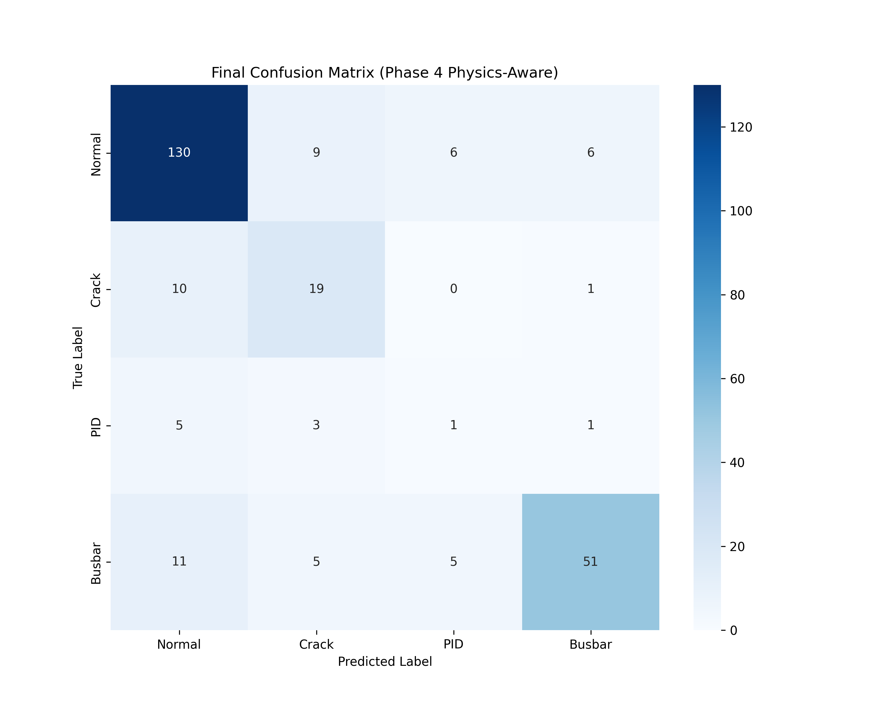

# Deep Photonics Reliability: Physics-Constrained PV Fault Analysis

## Overview
Deep Photonics Reliability is a state-of-the-art deep learning pipeline documentation for solving the "Black Box" challenge in Photovoltaic (PV) cell Electroluminescence (EL) image classification. Unlike standard classifiers that may optimize for non-physical background artifacts, this project implements **Physics-Constrained Supervision** to enforce spatial focus on the physical geometry of structural defects such as micro-cracks, Potential Induced Degradation (PID), and busbar anomalies.

---

## Roadmap

### Phase 1: Signal-Aided Data Engineering (FFT)
*   **Significance**: PV cells exhibit periodic manufacturing structures. Filtering this periodicity in the frequency domain allows the model to prioritize stochastic deviations (faults) over the deterministic background grid.

### Phase 3 & 4: From Explainability to Spatial Constraint
*   **Significance**: Phase 3 utilized Gradient-weighted Class Activation Mapping (Grad-CAM) to audit internal feature attention. Phase 4 operationalized these insights as a supervised constraint. By integrating a **Dice Loss** component into the objective function, the model transitioned from purely statistical classification to **Spatially-Aware Reliability**.

---

## Analysis & Visual Evidence

### 1. Training Dynamics (Phase 3 Baseline)

*   **Elaboration**: This plot illustrates the baseline convergence of the PhotonicResNet18 architecture. It establishes the benchmark for tri-channel EL classification before the introduction of physical regularization.

### 2. Statistical Metrics (Confusion Matrix)

*   **Elaboration**: The diagonal dominance indicates robust classification across all fault categories. The model maintains high precision in **Normal** and **Busbar** identification, reflecting stable feature extraction in high-noise environments.

### 3. Phase 3: Automated Teacher-Mask Generation


*   **Elaboration**: These samples illustrate the automated extraction of defect locations using Gradient-weighted Class Activation Mapping. By setting a high percentile threshold on activations, the system generates localized masks that provide the ground-truth guidance for the subsequent physics constraint.

#### The "Bad Mask" Case (Noise Analysis)

*   **Elaboration**: Sample 0508 represents a "hallucinated" mask where the model's focus is diffuse or triggered by background textures. This specific case provided the scientific justification for our **Phase 4 Quality Filter**, which automatically identifies and ignores masks with excessive coverage or low confidence to prevent the propagation of visual noise.

### 4. Phases Comparison: "The Attention Sharpening"


*   **Elaboration**: Comparison of attention focus between Phase 3 (Base) and Phase 4 (Physics-Aware):
    *   **Phase 3 (Standard)**: Demonstrates diffuse activation, often broad or influenced by global cell features.
    *   **Phase 4 (Physics-Aware)**: Characterized by precise localization centered on the physical defect path. This is achieved through Quadratic Attention Scaling and Multi-Objective Loss Optimization.

### 5. Blind-Test Inference (Unseen Data)


*   **Elaboration**: These **Blind Tests** demonstrate generalization to totally novel data across various fault conditions. The consistent localization of faults (ranging from micro-cracks to PID clusters) confirms that the architecture has internalized robust physical features rather than specific training-set noise. The high-confidence activations on unseen samples indicate that the physics constraint successfully regularized the feature space.

---

## Project Architecture
```text
├── results/final_evaluation/   # Confusion matrix, Training curves, Blind tests
├── data/phase_comparison/      # Comparative analysis images (P3 vs P4)
├── src/                        # Core implementation (Model, Engine, Pipeline)
└── config.yaml                 # Formalized hyperparameters (λ=0.25, LR=5e-5)
```

---

## Mathematical Foundation
The optimization process is formalized as a multi-objective task:
$$\mathcal{L}_{total} = \mathcal{L}_{Class} + \lambda \cdot [Dice(Attn, Mask) + BCE(Attn, Mask)]$$
By dynamically weighting the spatial regularization term ($\lambda$) based on Classification Confidence, the system ensures that spatial constraints are only enforced for high-probability class associations, thereby preventing the regularization of low-confidence feature noise.

---
**Mahmoud-N-Elmallah**
*Advancing reliability in renewable energy through Physics-Aware Machine Learning.*
